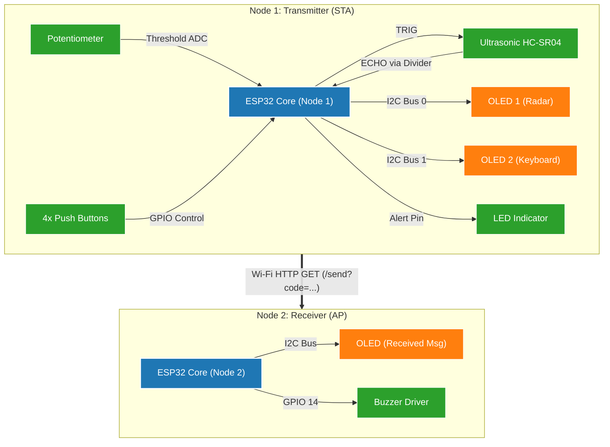

# 📡 ESP32 Intrusion Alert System

ระบบสื่อสารรหัสมอร์สไร้สายและตรวจจับสิ่งกีดขวางระยะใกล้ด้วย ESP32 จำนวน 2 บอร์ด โดยแบ่งการทำงานเป็นโหนดส่งข้อมูล (**Transmitter Node**) ที่มาพร้อมคีย์บอร์ดเสมือนและเรดาร์อัลตราโซนิก และโหนดรับข้อมูล (**Receiver Node**) ที่ทำหน้าที่เป็น Wi-Fi Access Point ถอดรหัสและแสดงสัญญาณเสียง/ภาพ

---
## 📖 ภาพรวมของโปรเจกต์ (Project Overview)

โปรเจกต์นี้เป็นการพัฒนาระบบสื่อสารรหัสมอร์สไร้สายแบบสองทิศทางจำลอง และระบบเตือนภัยเรดาร์ระยะใกล้ด้วยไมโครคอนโทรลเลอร์ **ESP32 จำนวน 2 บอร์ด** ทำงานประสานกันผ่านเครือข่าย Wi-Fi ท้องถิ่น (Local Wi-Fi Network) โดยไม่จำเป็นต้องพึ่งพาเราเตอร์หรืออินเทอร์เน็ตภายนอก

* **Node 1 (Transmitter / Client):** ทำหน้าที่เป็นสถานีตรวจจับและควบคุมอินพุต ติดตั้งเซนเซอร์ Ultrasonic HC-SR04 สำหรับสแกนระยะวัตถุแบบเรียลไทม์ควบคู่กับ Potentiometer เพื่อปรับเปลี่ยนระยะความปลอดภัย (Threshold) พร้อมระบบแป้นพิมพ์จำลอง 4 ปุ่ม (Up, Left, Right, Action) ที่แสดงผลบนหน้าจอคู่ (Dual OLED SSD1306 บนบัส I2C0 และ I2C1) เมื่อตรวจพบสิ่งกีดขวางจะทำการยิงรหัส SOS อัตโนมัติ หรือผู้ใช้งานสามารถพิมพ์ข้อความเพื่อส่งรหัสมอร์สผ่าน HTTP Request ได้
* **Node 2 (Receiver / Access Point):** ทำหน้าที่เป็น Wi-Fi Hotspot ("ESP32-Morse") และ Web Server เมื่อได้รับรหัสผ่านพอร์ต HTTP GET `/send?code=...` ระบบจะตอบรับสัญญาณทันทีแบบ Non-blocking จากนั้นประมวลผลถอดรหัสมอร์ส แสดงผลทีละตัวอักษรบนหน้าจอ OLED ค้างไว้ 1 วินาที พร้อมสั่งขับเสียง Active/Passive Buzzer แยกจังหวะจุดและขีดอย่างแม่นยำ ก่อนจะสรุปข้อความทั้งหมดค้างไว้บนหน้าจอ

---

## 📌 ภาพรวมสถาปัตยกรรมระบบ (System Architecture)

---

## ✨ ฟีเจอร์หลัก (Key Features)

### 1. โหนดส่ง (Transmitter Node)
- **Virtual Keyboard (OLED 2):** เลือกตัวอักษร A-Z, 0-9 และ Backspace ด้วยระบบ 4 ปุ่มกด
  - กดสั้นเพื่อพิมพ์ / กดค้างที่ปุ่ม Action (> 800ms) เพื่อส่งข้อความ
- **Dynamic Wi-Fi Status Icon:** แสดงสถานะการเชื่อมต่อ Wi-Fi และระดับ RSSI แบบเรียลไทม์ที่มุมขวาบนของหน้าจอ (ไอคอนจะหายไปทันทีเมื่อสัญญาณขาดหาย)
- **Ultrasonic Radar & Auto-SOS (OLED 1):** 
  - วัดระยะด้วย HC-SR04 และปรับค่า Threshold ผ่าน Potentiometer
  - ส่งรหัสฉุกเฉิน `... --- ...` (SOS) ไปยังโหนดรับอัตโนมัติทันที 1 ครั้งเมื่อมีวัตถุกีดขวางระยะปลอดภัย
- **Dual I2C Bus Management:** ใช้งานหน้าจอ OLED Address `0x3C` พร้อมกัน 2 จอได้อย่างอิสระ ผ่านฮาร์ดแวร์ `TwoWire(0)` และ `TwoWire(1)`

### 2. โหนดรับ (Receiver Node)
- **Stand-alone Access Point:** ปล่อยสัญญาณ Wi-Fi Hotspot ในตัว ไม่ต้องพึ่งพาเราเตอร์ภายนอก
- **Non-blocking Request Handling:** ตอบรับสถานะ HTTP 200 OK ทันที เพื่อป้องกันไม่ให้โหนดส่งติดค้างในลูป
- **Synchronized Audio & Visual Output:**
  - แสดงตัวอักษรขนาดใหญ่ด้านบนและรหัสมอร์สด้านล่าง ค้างไว้ตัวละ 1 วินาที
  - ขับสัญญาณเสียงผ่าน Buzzer แยกจังหวะ จุด (Dot) และ ขีด (Dash) อัตโนมัติ
  - สลับไปแสดงข้อความที่ถอดรหัสเสร็จสมบูรณ์ค้างไว้จนกว่าจะมีชุดข้อมูลใหม่เข้ามา

---

## 🛠 ข้อมูลการต่อวงจร (Pinout Configuration)

### Node 1: Transmitter (ตัวส่ง)
| อุปกรณ์ / เซนเซอร์ | ขาอุปกรณ์ | ขา ESP32 (GPIO) | หมายเหตุ |
| :--- | :--- | :--- | :--- |
| **OLED 1 (Radar)** | SDA / SCL | GPIO 21 / GPIO 22 | I2C Bus 0 (Address: `0x3C`) |
| **OLED 2 (Keyboard)** | SDA / SCL | GPIO 18 / GPIO 19 | I2C Bus 1 (Address: `0x3C`) |
| **HC-SR04** | TRIG / ECHO | GPIO 13 / GPIO 12 | ECHO ผ่าน Voltage Divider (1kΩ / 2kΩ) |
| **Potentiometer** | Output Pin | GPIO 34 | Analog In (ADC1_CH6) ช่วงแรงดัน 0-3.3V |
| **Alert LED** | Anode (+) | GPIO 5 | ต่ออนุกรมตัวต้านทาน 220-330Ω |
| **Button Left** | Data Pin | GPIO 15 | Active LOW (Internal Pull-up) |
| **Button Right** | Data Pin | GPIO 4 | Active LOW (Internal Pull-up) |
| **Button Up** | Data Pin | GPIO 16 | Active LOW (Internal Pull-up) |
| **Button Action** | Data Pin | GPIO 17 | Active LOW (Internal Pull-up) |

### Node 2: Receiver (ตัวรับ)
| อุปกรณ์ / เซนเซอร์ | ขาอุปกรณ์ | ขา ESP32 (GPIO) | หมายเหตุ |
| :--- | :--- | :--- | :--- |
| **OLED (Display)** | SDA / SCL | GPIO 21 / GPIO 22 | I2C Default Bus (Address: `0x3C`) |
| **Buzzer** | Positive (+) | GPIO 14 | ต่อผ่านทรานซิสเตอร์ขับโหลด หรือต่อโมดูล Active Buzzer |

---

## 📦 ไลบรารีที่จำเป็น (Required Libraries)

ติดตั้งไลบรารีผ่าน **Arduino Library Manager** หรือ `platformio.ini`:
- `Adafruit SSD1306` (โดย Adafruit)
- `Adafruit GFX Library` (โดย Adafruit)
- `ezButton` (โดย ArduinoGetStarted)
- `WiFi`, `WebServer`, `HTTPClient` (มีมาพร้อมกับบอร์ด ESP32 Core)

---

## 🚀 ขั้นตอนการใช้งาน (Quick Start)

1. **อัปโหลดเฟิร์มแวร์:**
   - แฟลชโค้ดตัวรับลงใน **ESP32 Node 2**
   - แฟลชโค้ดตัวส่งลงใน **ESP32 Node 1**
2. **เปิดเครื่อง:**
   - เริ่มการทำงานของ Node 2 ก่อน เพื่อให้ระบบเริ่มกระจายสัญญาณ Hotspot `ESP32-Morse`
   - เปิด Node 1 บอร์ดจะทำการต่อ Wi-Fi เข้ากับ Node 2 อัตโนมัติ (สังเกตไอคอน Wi-Fi มุมขวาบนของ OLED 2)
3. **การส่งข้อความ:**
   - เลื่อนปุ่มซ้าย/ขวา/ขึ้น เพื่อเลือกตัวอักษร
   - กดปุ่ม Action สั้นๆ เพื่อพิมพ์ตัวอักษรลง Buffer
   - กดปุ่ม Action ค้างไว้ 800 ms เพื่อส่งข้อความทั้งหมด
4. **การทำงานของระบบความปลอดภัย:**
   - ปรับ Potentiometer เพื่อตั้งระยะ Threshold (5 - 50 cm)
   - หากระยะที่วัดได้ต่ำกว่าเกณฑ์ ไฟ LED บนตัวส่งจะเริ่มกะพริบรหัส SOS พร้อมยิงสัญญาณเตือนภัยไปยัง Node 2 ทันที 1 ครั้ง

---
## 📷 IMAGE HARDWARE

| Node 1: Transmitter (ตัวส่ง) | Node 2: Receiver (ตัวรับ) |
| :---: | :---: |
|  |  |

---

## 🎥 Video Demonstration

| Video 1: Transmission | Video 2: Reception |
| :---: | :---: |
| https://github.com/user-attachments/assets/db6be04e-9f73-46ef-90a6-82b5907f0424 | https://github.com/user-attachments/assets/6cf24224-a0fb-4488-9bad-6ed21e289395 |

---

## 📑 รายการเอกสารทางเทคนิค (Component Datasheets)

รวบรวม Datasheet สำหรับอุปกรณ์อิเล็กทรอนิกส์และโมดูลทั้งหมดที่ใช้งานในระบบ:

| อุปกรณ์ / โมดูล | ฟังก์ชันในวงจร | เอกสารอ้างอิงทางเทคนิค (Datasheet) |
| :--- | :--- | :--- |
| **ESP32 (ESP-WROOM-32)** | ไมโครคอนโทรลเลอร์ Dual-Core สื่อสาร Wi-Fi/BLE | [Espressif ESP-WROOM-32 Datasheet](https://documentation.espressif.com/esp32-wroom-32_datasheet_en.pdf) |
| **SSD1306** | ตัวควบคุมจอแสดงผลกราฟิก Monochrome 128x64 OLED | [Solomon Systech SSD1306 Datasheet](https://cdn-shop.adafruit.com/datasheets/SSD1306.pdf) |
| **HC-SR04** | เซนเซอร์วัดระยะทางอัลตราโซนิกความแม่นยำสูง | [SparkFun HC-SR04 User Manual & Datasheet](https://www.alldatasheet.com/datasheet-pdf/view/1132204/ETC2/HCSR04.html) |

---

## 📑 เอกสารและคู่มือการใช้งาน (Documentation & Manual)

สามารถศึกษาคู่มือการใช้งานระบบ รายละเอียดโครงงาน และขั้นตอนการทดสอบแบบเต็มได้ที่เอกสาร Microsoft Sway:

> 🔗 **เข้าสู่คู่มือออนไลน์:** [คลิกที่นี่เพื่อเปิดคู่มือ (ESP32 Morse & Radar System Manual)](https://sway.cloud.microsoft/r6qcSzhI2a8yqh35?ref=Link)

---
